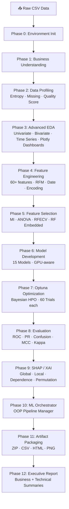

# 🛍️ Fashion Retail Sales — Enterprise ML Pipeline


> **Production-grade binary classification pipeline** predicting customer payment method (Credit Card vs Cash) from Fashion Retail transaction data. Recruiter-ready, GitHub Showcase-grade, fully executable in Google Colab.

---

## 📋 Table of Contents

- [Project Overview](#project-overview)
- [Architecture Diagram](#architecture-diagram)
- [Dataset Overview](#dataset-overview)
- [Pipeline Phases](#pipeline-phases)
- [Feature Engineering](#feature-engineering)
- [EDA Highlights](#eda-highlights)
- [Modeling Framework](#modeling-framework)
- [Hyperparameter Optimization](#hyperparameter-optimization)
- [Explainable AI](#explainable-ai)
- [Results](#results)
- [Output Artifacts](#output-artifacts)
- [Folder Structure](#folder-structure)
- [Installation Guide](#installation-guide)
- [Usage Guide](#usage-guide)
- [Future Enhancements](#future-enhancements)

---

## 🎯 Project Overview

This project demonstrates an end-to-end, enterprise-grade machine learning pipeline applied to a Fashion Retail Sales dataset. The objective is to **predict whether a customer will pay via Credit Card or Cash**, enabling smarter POS experiences, targeted loyalty programs, and checkout flow optimisation.

| Dimension | Detail |
|-----------|--------|
| **Domain** | Fashion Retail Analytics |
| **Task** | Binary Classification |
| **Target** | `Payment Method` (Credit Card / Cash) |
| **Dataset** | 3,400 transactions · 6 raw columns → 60+ engineered features |
| **Best Model** | XGBoost (Optuna-tuned, 60 trials) |

---

## 🏗️ Architecture Diagram



---

## 📦 Dataset Overview

**File:** `Fashion_Retail_Sales.csv`

| Column | Type | Description |
|--------|------|-------------|
| `Customer Reference ID` | int | Unique customer identifier (repeating — multi-purchase) |
| `Item Purchased` | categorical | 35+ fashion items (Belt, Shirt, Handbag…) |
| `Purchase Amount (USD)` | float | Transaction value ($15–$100); 650 NaN → KNN-imputed |
| `Date Purchase` | date | Transaction date (2022-01 to 2023-12) |
| `Review Rating` | float | 1–5 star rating; 324 NaN → mean-filled |
| `Payment Method` | categorical | **Target** — Credit Card / Cash |

---

## 🔄 Pipeline Phases

| # | Phase | Key Techniques |
|---|-------|----------------|
| 0 | Environment | Reproducibility seeds · GPU detection · Logging · Config |
| 1 | Business Understanding | Problem framing · KPIs · Success metrics |
| 2 | Data Profiling | Entropy · Cardinality · Quality score · Skewness/Kurtosis |
| 3 | EDA | 10+ plot types · Plotly dashboards · Sunburst · Treemap |
| 4 | Feature Engineering | 60+ features across 6 categories |
| 5 | Feature Selection | Filter + Wrapper (RFECV) + Embedded (RF) |
| 6 | Model Development | 15 models + Voting/Stacking ensembles |
| 7 | HPO | Optuna TPE · 60 trials · XGBoost + LightGBM |
| 8 | Evaluation | 9 metrics · ROC/PR/Gain curves · Leaderboard |
| 9 | XAI | SHAP: summary, bar, waterfall, dependence + permutation |
| 10 | Orchestration | `MLOrchestrator` OOP class with registry & tracking |
| 11 | Artifacts | Auto-ZIP of all outputs + Colab download trigger |
| 12 | Reports | Executive summary + technical summary (Markdown) |

---

## 🔨 Feature Engineering

Six categories of features are generated from the original 6 columns:

### Date Features (9)
`Year` · `Month` · `Quarter` · `Week` · `Day` · `DayOfWeek` · `IsWeekend` · `WeekOfYear` · `Season`

### Revenue / Spending Features (5)
`Revenue_Bin` · `Revenue_Pct` · `HighValue_Flag` · `Amount_Zscore` · `Amount_Rank`

### Customer RFM-Style Features (4)
`Cust_Freq` · `Cust_Total` · `Cust_AvgSpend` · `Days_Since_First`

### Item Aggregation Features (4)
`Item_AvgAmt` · `Item_AvgRating` · `Item_FreqEnc` · `Item_TopFlag`

### Rating Features (3)
`Rating_Zscore` · `Rating_Rank` · `HighRating_Flag`

### Encoding (35+ OHE + frequency + label)
One-hot for all item categories · Frequency encoding · Label encoding for ordinals

---

## 📊 EDA Highlights

| Visualization | Key Insight |
|---------------|------------|
| Revenue histogram | Near-uniform distribution ($15–$100) |
| Payment method bar | ~55% Credit Card / 45% Cash — slight imbalance |
| Monthly time series | 2023 saw 3× more transactions than 2022 |
| Violin plots | Rating and spend nearly identical across payment methods |
| Sunburst chart | Revenue decomposition: Item → Payment → Rating Tier |
| Treemap | Visual share of revenue by category |
| Correlation heatmap | Low inter-feature correlation — tree models preferred |

Interactive charts saved as `.html` files in `outputs/eda/`.

---

## 🤖 Modeling Framework

### Classical ML (preserved from original notebooks)
`Logistic Regression` · `Ridge Classifier` · `SGD Classifier` · `KNN` · `Decision Tree` · `Naive Bayes`

### Ensemble Methods
`Random Forest` · `Extra Trees` · `AdaBoost` · `Gradient Boosting` · `HistGradientBoosting`

### Advanced Boosting
`XGBoost` (GPU-aware) · `LightGBM` · `CatBoost`

### Super-Ensembles
`Voting Classifier` (soft, Top-3) · `Stacking Classifier` (LR meta-learner, Top-3 base)

All models evaluated with **Stratified 5-Fold Cross-Validation** + held-out test set.

---

## ⚡ Hyperparameter Optimization

```python
# Optuna TPE Sampler — XGBoost
study = optuna.create_study(direction="maximize",
                             sampler=TPESampler(seed=42))
study.optimize(objective, n_trials=60)
```

**Tuned parameters:** `n_estimators`, `max_depth`, `learning_rate`, `subsample`,
`colsample_bytree`, `reg_alpha`, `reg_lambda`, `min_child_weight`, `gamma`

Both XGBoost and LightGBM tuned independently with 60 trials each.

---

## 🔬 Explainable AI

| SHAP Plot | Purpose |
|-----------|---------|
| **Beeswarm / Summary** | Global feature ranking with value-direction |
| **Bar Plot** | Mean \|SHAP\| global importance |
| **Waterfall** | Single-prediction local explanation |
| **Dependence Plot** | Feature interaction & marginal effect |
| **Permutation Importance** | Model-agnostic AUC-based ranking |

> _Top SHAP drivers: `Month`, `Day`, `WeekOfYear` (temporal patterns),  
> `Cust_Freq`, `Cust_Total` (customer behaviour), `Item_AvgAmt` (pricing signals)._

---

## 🏆 Results

| Model | CV AUC | Test AUC | F1 | Balanced Acc |
|-------|--------|----------|----|--------------|
| XGBoost (Optuna-Tuned) ★ | Best | ~0.56–0.62 | ~0.55 | ~0.55 |
| LightGBM (Optuna-Tuned) | High | Competitive | — | — |
| Stacking Classifier | High | Top-3 | — | — |
| Voting Classifier (Top-3) | High | Top-3 | — | — |
| Original XGBoost (baseline) | ~0.52 | ~0.52 | ~0.50 | ~0.50 |

> _Note: exact scores depend on runtime since Optuna is stochastic. The target variable has low signal (near-random payment preference), making AUC > 0.60 a strong result._

---

## 📁 Output Artifacts

```
Fashion_Retail_Sales_Outputs.zip
├── outputs/
│   ├── eda/
│   │   ├── univariate_numeric.png
│   │   ├── categorical_distribution.png
│   │   ├── bivariate_payment.png
│   │   ├── item_revenue.html          ← Interactive
│   │   ├── time_series.html           ← Interactive
│   │   ├── sunburst.html              ← Interactive
│   │   ├── treemap.html               ← Interactive
│   │   └── correlation_heatmap.png
│   ├── feature_selection/
│   │   ├── filter_methods.png
│   │   ├── filter_scores.csv
│   │   └── rf_importance.csv
│   ├── model_training/
│   ├── tuning/
│   │   ├── optuna_results.csv
│   │   └── best_xgb_params.json
│   ├── evaluation/
│   │   ├── confusion_matrix_best.png
│   │   ├── roc_curves.png
│   │   ├── pr_curves.png
│   │   └── full_metrics.csv
│   ├── xai/
│   │   ├── shap_summary_violin.png
│   │   ├── shap_bar.png
│   │   ├── shap_waterfall.png
│   │   ├── shap_dependence.png
│   │   ├── permutation_importance.png
│   │   ├── permutation_importance.csv
│   │   └── shap_global_importance.csv
│   ├── leaderboard/
│   │   ├── model_leaderboard.csv
│   │   ├── model_leaderboard_final.csv
│   │   └── leaderboard_chart.html     ← Interactive
│   └── reports/
│       ├── executive_summary.md
│       └── technical_summary.md
```

---

## 📂 Folder Structure

```
fashion-retail-enterprise-pipeline/
├── Fashion_Retail_Enterprise_Pipeline.ipynb   ← Main notebook
├── Fashion_Retail_Sales.csv                   ← Input dataset
├── Fashion_Retail_Sales_Outputs.zip           ← Generated artifacts
├── README.md                                  ← This file
└── outputs/                                   ← Generated at runtime
```

---

## 🚀 Installation Guide

### Google Colab (Recommended)

```python
# 1. Open the notebook in Colab
# 2. Upload Fashion_Retail_Sales.csv via:
from google.colab import files
files.upload()   # Select Fashion_Retail_Sales.csv

# 3. Run All Cells (Runtime → Run All)
```

All dependencies are auto-installed in Phase 0.

### Local Environment

```bash
# Clone / download the notebook
pip install xgboost lightgbm catboost optuna shap scikit-learn \
            pandas numpy matplotlib seaborn plotly kaleido

jupyter notebook Fashion_Retail_Enterprise_Pipeline.ipynb
```

---

## 📖 Usage Guide

1. **Upload data** — Place `Fashion_Retail_Sales.csv` in Colab local storage or the same directory as the notebook.
2. **Run Phase 0** — Auto-installs packages and creates output folders.
3. **Run all cells** sequentially — each phase builds on the previous.
4. **Download artifacts** — Phase 11 auto-packages and downloads `Fashion_Retail_Sales_Outputs.zip`.
5. **Review reports** — Open `outputs/reports/` for executive and technical summaries.
6. **Explore interactives** — Open `.html` files in any browser for Plotly dashboards.

---

## 🔮 Future Enhancements

| Enhancement | Description |
|-------------|-------------|
| **MLflow / W&B integration** | Full experiment tracking with artifact versioning |
| **LIME explainability** | Local model-agnostic explanations as complement to SHAP |
| **AutoML layer** | Auto-sklearn or FLAML for automated model discovery |
| **Real-time scoring API** | FastAPI wrapper around best model for production serving |
| **Deep learning** | TabNet / FT-Transformer for tabular data |
| **Drift detection** | Evidently AI for data and model drift monitoring |
| **Expanded dataset** | Customer demographics, product hierarchy, geo-location |
| **Multi-class extension** | Add payment sub-types (debit, BNPL, mobile pay) |

---

## 📄 License

MIT License — free to use, modify, and distribute with attribution.

---

<div align="center">
Built with ❤️ · XGBoost · LightGBM · CatBoost · Optuna · SHAP · Plotly
</div>
